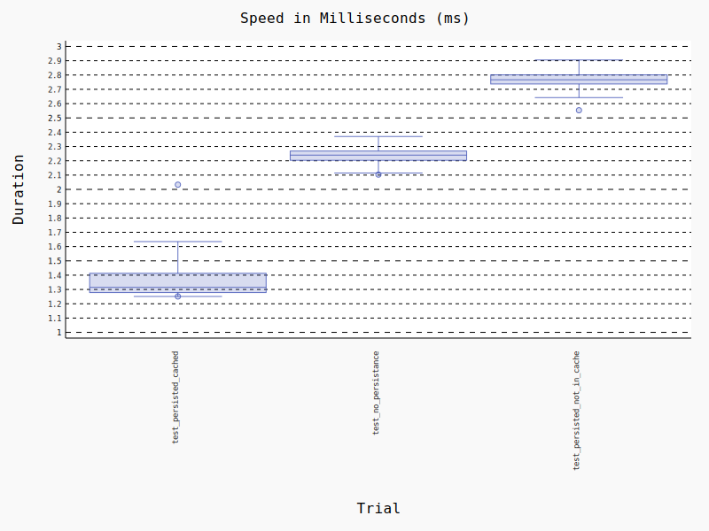

# strawberry-apollo-apq
Supporting [Apollo's automatic persisted queries](https://www.apollographql.com/docs/apollo-server/performance/apq/)
in [Strawberry GraphQL](https://github.com/strawberry-graphql/strawberry) 🍓

## Notes

- Don't use this for production yet, unless you know what you're doing.
- For persisting queries, a simple `TTLCache` is used. Will be changed later.
- Only flask views are supported for now.

## Benchmarks

## License
The code in this library is licensed under MIT license. See the [LICENSE.md](LICENSE.md) file for more information.

